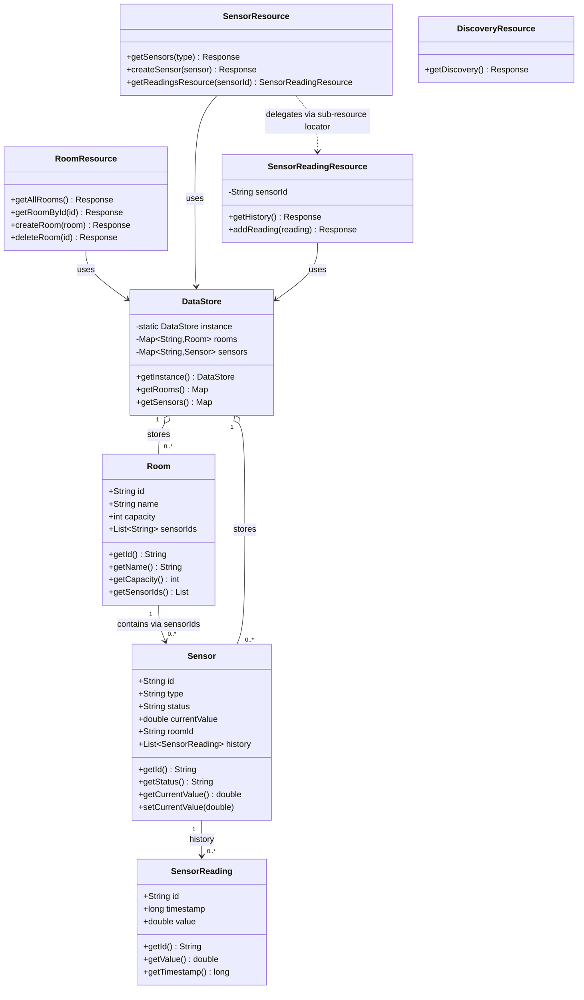

# Smart Campus API
**Module:** 5COSC022W – Client-Server Architectures | **Weight:** 60%

A fully RESTful web service built with **JAX-RS (Jersey 3.1.1)** and an embedded **Grizzly HTTP server**. It manages Rooms, Sensors, and Sensor Readings for a university "Smart Campus" initiative.

**Tech Stack:** Java 17 · JAX-RS (Jersey 3.1.1) · Grizzly HTTP Server · JSON-B · Maven  
**Storage:** In-memory `ConcurrentHashMap` — no database used  
**Base URL:** `http://localhost:8080/api/v1`

---

## Project Structure

```
smart-campus-api/
├── pom.xml
├── README.md
└── src/main/java/com/smartcampus/
    ├── Main.java                          # Starts the embedded Grizzly server
    ├── config/
    │   └── SmartCampusApp.java            # @ApplicationPath("/api/v1") - registers all classes
    ├── data/
    │   └── DataStore.java                 # Singleton in-memory store (ConcurrentHashMap)
    ├── exceptions/
    │   ├── LinkedResourceNotFoundException.java
    │   ├── RoomNotEmptyException.java
    │   └── SensorUnavailableException.java
    ├── models/
    │   ├── Room.java
    │   ├── Sensor.java
    │   └── SensorReading.java
    ├── providers/
    │   ├── ApiLoggingFilter.java
    │   ├── GlobalExceptionMapper.java
    │   ├── LinkedResourceNotFoundMapper.java
    │   ├── ResponseHelper.java
    │   ├── RoomNotEmptyExceptionMapper.java
    │   └── SensorUnavailableExceptionMapper.java
    └── resources/
        ├── DiscoveryResource.java
        ├── RoomResource.java
        ├── SensorResource.java
        └── SensorReadingResource.java
```

---

## Build & Run Instructions

**Prerequisites:** Java 17+, Maven 3.6+

```bash
# 1. Clone the repository
git clone https://github.com/YOUR_USERNAME/smart-campus-api.git
cd smart-campus-api

# 2. Build the project
mvn clean compile

# 3. Run the embedded server
mvn exec:java

# Server starts at: http://localhost:8080/api/v1
# Press Enter in the terminal to shut it down
```

---

## API Endpoints

### Part 1 – Discovery
| Method | Path | Description | Status |
|--------|------|-------------|--------|
| GET | `/api/v1` | API metadata + HATEOAS links | 200 |

### Part 2 – Room Management
| Method | Path | Description | Status |
|--------|------|-------------|--------|
| GET | `/api/v1/rooms` | List all rooms | 200 |
| POST | `/api/v1/rooms` | Create a new room | 201 |
| GET | `/api/v1/rooms/{roomId}` | Get a single room | 200 / 404 |
| DELETE | `/api/v1/rooms/{roomId}` | Delete room (blocked if sensors exist) | 204 / 404 / 409 |

### Part 3 – Sensor Operations
| Method | Path | Description | Status |
|--------|------|-------------|--------|
| GET | `/api/v1/sensors` | List all sensors | 200 |
| GET | `/api/v1/sensors?type=CO2` | Filter sensors by type | 200 |
| POST | `/api/v1/sensors` | Register sensor (validates roomId) | 201 / 422 |

### Part 4 – Sensor Readings (Sub-Resource)
| Method | Path | Description | Status |
|--------|------|-------------|--------|
| GET | `/api/v1/sensors/{sensorId}/readings` | Get full reading history | 200 / 404 |
| POST | `/api/v1/sensors/{sensorId}/readings` | Add reading + updates `currentValue` | 201 / 403 / 404 |

### Error Code Reference
| Code | Trigger |
|------|---------|
| 403 | POST reading to a MAINTENANCE sensor |
| 404 | Resource ID not found |
| 409 | DELETE room that still has sensors assigned |
| 422 | POST sensor with a `roomId` that does not exist |
| 500 | Any unexpected runtime error (no stack trace exposed) |

---

## Class Diagram



---

## Sample curl Commands

### 1. GET – Discovery Endpoint (HATEOAS)

```bash
curl -X GET \
  http://localhost:8080/api/v1 \
  -H "Accept: application/json"
```

**Expected:** `200 OK` — JSON with API name, version, admin contact, and `_links` map pointing to `/api/v1/rooms` and `/api/v1/sensors`

---

### 2. GET – List All Rooms

```bash
curl -X GET \
  http://localhost:8080/api/v1/rooms \
  -H "Accept: application/json"
```

**Expected:** `200 OK` — JSON array of all rooms currently in the system, each with `id`, `name`, `capacity`, and `sensorIds`

---

### 3. POST – Create a New Room

```bash
curl -X POST \
  http://localhost:8080/api/v1/rooms \
  -H "Content-Type: application/json" \
  -d '{
    "id": "ENG-205",
    "name": "Engineering Design Studio",
    "capacity": 40
  }'
```

**Expected:** `201 Created` — response body contains the created room object; check response headers for `Location: /api/v1/rooms/ENG-205`

---

### 4. DELETE – Room WITH Sensors Assigned (Blocked)

```bash
curl -X DELETE \
  http://localhost:8080/api/v1/rooms/LIB-301
```

**Expected:** `409 Conflict` — JSON error body explaining the room still has active sensors and cannot be deleted until they are removed first

---

### 5. DELETE – Successfully Delete an Empty Room

```bash
curl -X DELETE \
  http://localhost:8080/api/v1/rooms/ENG-205
```

**Expected:** `204 No Content` — room has no sensors assigned, deletion succeeds; sending this request a second time returns `404 Not Found` (idempotent behaviour)

---

### 6. POST – Register Sensor with a Non-Existent roomId (Validation Fail)

```bash
curl -X POST \
  http://localhost:8080/api/v1/sensors \
  -H "Content-Type: application/json" \
  -d '{
    "id": "TEMP-999",
    "type": "Temperature",
    "status": "ACTIVE",
    "currentValue": 20.0,
    "roomId": "ROOM-DOES-NOT-EXIST"
  }'
```

**Expected:** `422 Unprocessable Entity` — the request body is valid JSON but the `roomId` reference cannot be resolved in the system; `LinkedResourceNotFoundException` is thrown and mapped by `LinkedResourceNotFoundMapper`

---

### 7. POST – Register Sensor Successfully

```bash
curl -X POST \
  http://localhost:8080/api/v1/sensors \
  -H "Content-Type: application/json" \
  -d '{
    "id": "TEMP-003",
    "type": "Temperature",
    "status": "ACTIVE",
    "currentValue": 21.0,
    "roomId": "LIB-301"
  }'
```

**Expected:** `201 Created` — sensor is stored in `DataStore`, and `LIB-301`'s `sensorIds` list is updated to include `TEMP-003`; `Location` header points to the new resource

---

### 8. GET – Filter Sensors by Type (Query Parameter)

```bash
curl -X GET \
  "http://localhost:8080/api/v1/sensors?type=CO2" \
  -H "Accept: application/json"
```

**Expected:** `200 OK` — only sensors whose `type` matches `CO2` (case-insensitive) are returned; all other sensor types are excluded from the response

---

### 9. POST – Add Reading to a MAINTENANCE Sensor (Blocked)

```bash
curl -X POST \
  http://localhost:8080/api/v1/sensors/OCC-001/readings \
  -H "Content-Type: application/json" \
  -d '{"value": 15.0}'
```

**Expected:** `403 Forbidden` — `OCC-001` has status `MAINTENANCE`; `SensorUnavailableException` is thrown and mapped to 403, reading is not saved

---

### 10. POST – Add Reading to an Active Sensor

```bash
curl -X POST \
  http://localhost:8080/api/v1/sensors/TEMP-001/readings \
  -H "Content-Type: application/json" \
  -d '{"value": 25.3}'
```

**Expected:** `201 Created` — reading is saved with a UUID `id` and epoch `timestamp` auto-generated by the server; the parent sensor's `currentValue` is immediately updated to `25.3`

---

### 11. GET – Verify currentValue Was Updated on Parent Sensor

```bash
curl -X GET \
  http://localhost:8080/api/v1/sensors/TEMP-001 \
  -H "Accept: application/json"
```

**Expected:** `200 OK` — the `currentValue` field on `TEMP-001` now shows `25.3`, confirming that the POST reading in step 10 triggered the side-effect update on the parent sensor object

---

### 12. GET – Retrieve Full Reading History for a Sensor

```bash
curl -X GET \
  http://localhost:8080/api/v1/sensors/TEMP-001/readings \
  -H "Accept: application/json"
```

**Expected:** `200 OK` — JSON array of all historical readings for `TEMP-001`, each containing `id` (UUID), `timestamp` (epoch ms), and `value`; the reading from step 10 appears in this list

---

## Report – Question Answers

### Part 1.1 – JAX-RS Resource Lifecycle

By default, JAX-RS creates a **brand new instance** of a resource class for **every single request** that comes in. This is called "per-request" scope. It is the default behaviour.

This matters a lot for how we store data. If each request gets its own object, you cannot store data inside the resource class itself — it would just disappear after the request is done. That is why I used a **singleton `DataStore`** class with `ConcurrentHashMap`. The DataStore is created once and shared across all requests. `ConcurrentHashMap` is important because multiple requests can hit the server at the same time, and it handles that safely without corrupting the data or causing race conditions.

---

### Part 1.2 – Why HATEOAS is Useful

HATEOAS means the API response includes **links** telling the client what it can do next, instead of just returning raw data. For example, the discovery endpoint at `GET /api/v1` returns links to `/api/v1/rooms` and `/api/v1/sensors`.

The benefit for developers is that they do not need to memorise or hardcode the URLs. The API tells them where to go. If the API ever changes a URL, the client does not break — it just follows the updated link. It is like a website where you click links instead of having to type every URL by hand.

---

### Part 2.1 – Returning IDs vs Full Objects in a List

If you return **only IDs**, the client has to make a separate HTTP request for each one to get the details — this is called the "N+1 problem" and wastes a lot of time and bandwidth.

If you return **full objects**, the client gets everything in one request, which is faster and simpler. The downside is the response payload is bigger. For a campus system with thousands of rooms, returning full objects might slow things down. A good middle ground is returning the full objects in a list but keeping the data lightweight (no nested sub-resources).

---

### Part 2.2 – Is DELETE Idempotent?

Yes, DELETE is idempotent. Idempotent means **doing the same thing multiple times has the same result** as doing it once.

In my implementation, the first DELETE on a room removes it and returns `204 No Content`. If the client sends the exact same DELETE request again, the room is already gone, so it returns `404 Not Found`. The **state of the server does not change** on the second call — the room is still gone. This is still considered idempotent because no additional side effects happen. The server ends up in the same state regardless of how many times you send that request.

---

### Part 3.1 – What Happens with a Wrong Content-Type

The `@Consumes(MediaType.APPLICATION_JSON)` annotation tells JAX-RS that this endpoint **only accepts JSON**. If a client sends `text/plain` or `application/xml`, JAX-RS checks the `Content-Type` header on the incoming request and sees it does not match.

JAX-RS automatically returns **HTTP 415 Unsupported Media Type**. It does not even pass the request to my method. The framework handles the rejection before any of my code runs. This is one of the benefits of using annotations — validation is built in.

---

### Part 3.2 – @QueryParam vs Path Segment for Filtering

Using `@QueryParam` (e.g., `GET /api/v1/sensors?type=CO2`) is better for filtering because:

- The **base resource** is still `/api/v1/sensors` — a clean, consistent path
- Query parameters are **optional** — if you leave it out, you get all sensors; if you add it, you filter
- It is much easier to add more filters later (e.g., `?type=CO2&status=ACTIVE`) without changing the URL structure
- Using the type in the path (e.g., `/api/v1/sensors/type/CO2`) makes the URL look like `CO2` is a specific resource with its own ID, which is semantically wrong — you are not fetching *a* type, you are filtering *a collection*

Query parameters are for **searching and filtering**. Path segments are for **identifying specific resources**.

---

### Part 4.1 – Benefits of the Sub-Resource Locator Pattern

Instead of putting every nested path (`/sensors/{id}/readings`, `/sensors/{id}/readings/{rid}`) inside one giant `SensorResource` class, the sub-resource locator pattern **delegates** that work to a separate class.

In my code, `SensorResource` has one locator method that returns a `SensorReadingResource` instance. JAX-RS then hands control over to that class for anything under `/{sensorId}/readings`.

The benefits are:
- **Separation of concerns** — each class has one job
- **Easier to maintain** — if you change how readings work, you only touch `SensorReadingResource`
- **Easier to test** — you can test the readings logic in isolation
- In a large API with many nested resources, keeping everything in one class would make it hundreds of lines long and very hard to navigate

---

### Part 5.2 – Why 422 is Better Than 404 Here

`404 Not Found` means the **URL or endpoint itself does not exist**. But in this case, the endpoint `/api/v1/sensors` definitely exists — the request arrived there fine.

The problem is that the **data inside the request body** references a `roomId` that does not exist. The request was valid in format, but logically broken.

`422 Unprocessable Entity` means "I understood your request, I can read it, but I cannot process it because the content is invalid." This is much more accurate. It tells the client the problem is with their data, not with the URL they used. It helps the developer debug the issue faster.

---

### Part 5.4 – Security Risk of Exposing Stack Traces

A Java stack trace contains a lot of sensitive internal information:

- **Class names and package structure** — attackers can learn exactly how the code is organised
- **File names and line numbers** — they can pinpoint exactly where errors happen
- **Library versions** — if a known vulnerable version is visible, attackers can look up specific exploits for it
- **Database queries or internal logic** — sometimes error messages include query strings or variable values

An attacker can use this to map out the system, find weak points, and craft targeted attacks. The fix is simple: never send raw exceptions to the client. My `GlobalExceptionMapper` catches all `Throwable` and returns a plain `500` with a generic message instead.

---

### Part 5.5 – Why Filters for Logging Instead of Manual Logger Calls

If you put `Logger.info()` inside every resource method manually, you have to:

- Remember to add it to every new method you write
- Write the same boilerplate code dozens of times
- Update it in many places if you want to change the format

A `ContainerRequestFilter` and `ContainerResponseFilter` run **automatically for every single request and response**, without touching any resource method. This is called a cross-cutting concern — something that applies everywhere but is not part of the actual business logic.

Filters keep the resource classes clean and focused on what they do. Logging, authentication checks, and CORS headers are all good candidates for filters. If you ever need to change the log format, you change it in one place and it applies everywhere instantly.
