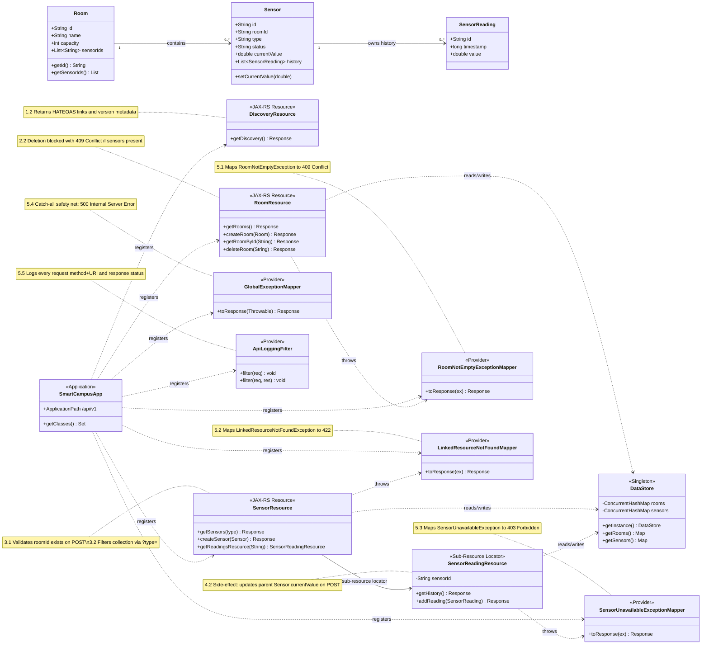

# __Smart Campus API System__                    
**Module:** 5COSC022W – Client-Server Architectures |

**Developed By:** Mario Ockersz | 20240362

A fully RESTful web service built with **JAX-RS (Jersey 3.1.1)** and an embedded **Grizzly HTTP server**. It manages Rooms, Sensors, and Sensor Readings for a university "Smart Campus" initiative.

**Tech Stack:** Java 17 · JAX-RS (Jersey 3.1.1) · Grizzly HTTP Server · JSON-B · Maven  
**Storage:** In-memory `ConcurrentHashMap` — no database used  
**Primary URL:** `http://localhost:8080/api/v1`

---

## Project Structure

```
smart-campus-api/
├── pom.xml
├── README.md
└── src/main/java/com/smartcampus/
    ├── Main.java                          # Starts the embedded Grizzly server
    ├── config/
    │   └── SmartCampusApp.java            # @ApplicationPath("/api/v1") - registers all classes
    ├── data/
    │   └── DataStore.java                 # Singleton in-memory store (ConcurrentHashMap)
    ├── exceptions/
    │   ├── LinkedResourceNotFoundException.java
    │   ├── RoomNotEmptyException.java
    │   └── SensorUnavailableException.java
    ├── models/
    │   ├── Room.java
    │   ├── Sensor.java
    │   └── SensorReading.java
    ├── providers/
    │   ├── ApiLoggingFilter.java
    │   ├── GlobalExceptionMapper.java
    │   ├── LinkedResourceNotFoundMapper.java
    │   ├── ResponseHelper.java
    │   ├── RoomNotEmptyExceptionMapper.java
    │   └── SensorUnavailableExceptionMapper.java
    └── resources/
        ├── DiscoveryResource.java
        ├── RoomResource.java
        ├── SensorResource.java
        └── SensorReadingResource.java
```

---

## Build & Run Instructions

**Prerequisites:** Java 17+, Maven 3.6+

```bash
# 1. Clone the repository
git clone https://github.com/YOUR_USERNAME/smart-campus-api.git
cd smart-campus-api

# 2. Build the project
mvn clean compile

# 3. Run the embedded server
mvn exec:java

# Server starts at: http://localhost:8080/api/v1
# Press Enter in the terminal to shut it down
```

---

## API Endpoints

### Part 1 – Discovery
| Method | Path | Description | Status |
|--------|------|-------------|--------|
| GET | `/api/v1` | API metadata + HATEOAS links | 200 |

### Part 2 – Room Management
| Method | Path | Description | Status |
|--------|------|-------------|--------|
| GET | `/api/v1/rooms` | List all rooms | 200 |
| POST | `/api/v1/rooms` | Create a new room | 201 |
| GET | `/api/v1/rooms/{roomId}` | Get a single room | 200 / 404 |
| DELETE | `/api/v1/rooms/{roomId}` | Delete room (blocked if sensors exist) | 204 / 404 / 409 |

### Part 3 – Sensor Operations
| Method | Path | Description | Status |
|--------|------|-------------|--------|
| GET | `/api/v1/sensors` | List all sensors | 200 |
| GET | `/api/v1/sensors?type=CO2` | Filter sensors by type | 200 |
| POST | `/api/v1/sensors` | Register sensor (validates roomId) | 201 / 422 |

### Part 4 – Sensor Readings (Sub-Resource)
| Method | Path | Description | Status |
|--------|------|-------------|--------|
| GET | `/api/v1/sensors/{sensorId}/readings` | Get full reading history | 200 / 404 |
| POST | `/api/v1/sensors/{sensorId}/readings` | Add reading + updates `currentValue` | 201 / 403 / 404 |

### Error Code Reference
| Code | Trigger |
|------|---------|
| 403 | POST reading to a MAINTENANCE sensor |
| 404 | Resource ID not found |
| 409 | DELETE room that still has sensors assigned |
| 422 | POST sensor with a `roomId` that does not exist |
| 500 | Any unexpected runtime error (no stack trace exposed) |

---

## Class Diagram



---

## Sample curl Commands

### 1. GET – Discovery Endpoint (HATEOAS)

```bash
curl -X GET \
  http://localhost:8080/api/v1 \
  -H "Accept: application/json"
```

**Expected:** `200 OK` — JSON with API name, version, admin contact, and `_links` map pointing to `/api/v1/rooms` and `/api/v1/sensors`

---

### 2. GET – List All Rooms

```bash
curl -X GET \
  http://localhost:8080/api/v1/rooms \
  -H "Accept: application/json"
```

**Expected:** `200 OK` — JSON array of all rooms currently in the system, each with `id`, `name`, `capacity`, and `sensorIds`

---

### 3. POST – Create a New Room

```bash
curl -X POST \
  http://localhost:8080/api/v1/rooms \
  -H "Content-Type: application/json" \
  -d '{
    "id": "ENG-205",
    "name": "Engineering Design Studio",
    "capacity": 40
  }'
```

**Expected:** `201 Created` — response body contains the created room object; check response headers for `Location: /api/v1/rooms/ENG-205`

---

### 4. DELETE – Room WITH Sensors Assigned (Blocked)

```bash
curl -X DELETE \
  http://localhost:8080/api/v1/rooms/LIB-301
```

**Expected:** `409 Conflict` — JSON error body explaining the room still has active sensors and cannot be deleted until they are removed first

---

### 5. DELETE – Successfully Delete an Empty Room

```bash
curl -X DELETE \
  http://localhost:8080/api/v1/rooms/ENG-205
```

**Expected:** `204 No Content` — room has no sensors assigned, deletion succeeds; sending this request a second time returns `404 Not Found` (idempotent behaviour)

---

### 6. POST – Register Sensor with a Non-Existent roomId (Validation Fail)

```bash
curl -X POST \
  http://localhost:8080/api/v1/sensors \
  -H "Content-Type: application/json" \
  -d '{
    "id": "TEMP-999",
    "type": "Temperature",
    "status": "ACTIVE",
    "currentValue": 20.0,
    "roomId": "ROOM-DOES-NOT-EXIST"
  }'
```

**Expected:** `422 Unprocessable Entity` — the request body is valid JSON but the `roomId` reference cannot be resolved in the system; `LinkedResourceNotFoundException` is thrown and mapped by `LinkedResourceNotFoundMapper`

---

### 7. POST – Register Sensor Successfully

```bash
curl -X POST \
  http://localhost:8080/api/v1/sensors \
  -H "Content-Type: application/json" \
  -d '{
    "id": "TEMP-003",
    "type": "Temperature",
    "status": "ACTIVE",
    "currentValue": 21.0,
    "roomId": "LIB-301"
  }'
```

**Expected:** `201 Created` — sensor is stored in `DataStore`, and `LIB-301`'s `sensorIds` list is updated to include `TEMP-003`; `Location` header points to the new resource

---

### 8. GET – Filter Sensors by Type (Query Parameter)

```bash
curl -X GET \
  "http://localhost:8080/api/v1/sensors?type=CO2" \
  -H "Accept: application/json"
```

**Expected:** `200 OK` — only sensors whose `type` matches `CO2` (case-insensitive) are returned; all other sensor types are excluded from the response

---

### 9. POST – Add Reading to a MAINTENANCE Sensor (Blocked)

```bash
curl -X POST \
  http://localhost:8080/api/v1/sensors/OCC-001/readings \
  -H "Content-Type: application/json" \
  -d '{"value": 15.0}'
```

**Expected:** `403 Forbidden` — `OCC-001` has status `MAINTENANCE`; `SensorUnavailableException` is thrown and mapped to 403, reading is not saved

---

### 10. POST – Add Reading to an Active Sensor

```bash
curl -X POST \
  http://localhost:8080/api/v1/sensors/TEMP-001/readings \
  -H "Content-Type: application/json" \
  -d '{"value": 25.3}'
```

**Expected:** `201 Created` — reading is saved with a UUID `id` and epoch `timestamp` auto-generated by the server; the parent sensor's `currentValue` is immediately updated to `25.3`

---

### 11. GET – Verify currentValue Was Updated on Parent Sensor

```bash
curl -X GET \
  http://localhost:8080/api/v1/sensors/TEMP-001 \
  -H "Accept: application/json"
```

**Expected:** `200 OK` — the `currentValue` field on `TEMP-001` now shows `25.3`, confirming that the POST reading in step 10 triggered the side-effect update on the parent sensor object

---

### 12. GET – Retrieve Full Reading History for a Sensor

```bash
curl -X GET \
  http://localhost:8080/api/v1/sensors/TEMP-001/readings \
  -H "Accept: application/json"
```

**Expected:** `200 OK` — JSON array of all historical readings for `TEMP-001`, each containing `id` (UUID), `timestamp` (epoch ms), and `value`; the reading from step 10 appears in this list

---


## Coursework Report – Question Answers

### Part 1.1 – JAX-RS Lifecycle and Concurrency
JAX-RS creates a new resource object for every HTTP request. So the resource class itself doesn’t have threading issues – each request gets its own copy.

The problem is the data store. I made the `DataStore` a singleton that all requests share. To keep it safe, I used `ConcurrentHashMap` for both rooms and sensors. It lets many threads read at the same time and only locks small parts when writing, so the API stays fast. For checks like “does this room exist before I create a sensor”, I do a simple `containsKey` followed by a `put`. Because each operation is atomic and I’m not iterating over the map at that moment, there’s no race-condition window. This keeps the data safe without slowing everything down.

### Part 1.2 – HATEOAS and the Discovery Endpoint
HATEOAS means the API gives you links to other resources inside the response itself. My discovery endpoint `GET /api/v1` returns a `_links` object with URLs for `/rooms` and `/sensors`.

Why is this better than a PDF document? Because the client doesn’t have to hardcode the URLs. If I ever change a path, the client just follows the link from the response – it won’t break. It also helps new developers see what’s available right away without reading extra docs.

### Part 2.1 – ID-Only vs Full Object Lists
If I return only room IDs, the client has to make a separate request for each room to get details – that’s the N+1 problem and it wastes time.

If I return the full room objects in one go, the client gets everything it needs in a single request. The downside is the response is bigger. For the size of a campus, returning full objects is fine. In a bigger system I’d add a `?fields=id,name` option so clients can choose.

### Part 2.2 – Idempotency of DELETE
Yes, `DELETE /rooms/{id}` is idempotent. That means calling it ten times has the same end result as calling it once.

The first time, if the room is empty, I delete it and send `204 No Content`. The second time, the room is already gone so I return `404 Not Found`. The server state is still “room deleted”. Because the state doesn’t change after the first call, the operation is idempotent.

### Part 3.1 – @Consumes and Media Type Mismatches
The `@Consumes(MediaType.APPLICATION_JSON)` annotation tells JAX‑RS that the endpoint only accepts JSON. If a client sends something else, like `text/plain`, JAX‑RS looks at the `Content-Type` header, sees it’s not JSON, and stops the request before it even reaches my method. It automatically sends back `415 Unsupported Media Type`. That’s a nice safety net – I don’t have to check the content type myself.

### Part 3.2 – @QueryParam vs Path Parameter for Filtering
I used `?type=CO2` (query parameter) for filtering. It keeps the main resource path clean (`/sensors` is still the collection). The filter is optional – leave it out and you get everything.

If I had put the type in the path like `/sensors/type/CO2`, it would make CO2 look like a resource instead of just a filter value. Query parameters are better because you can easily combine filters like `?type=CO2&status=ACTIVE`, and they don’t mess up the URL structure.

### Part 4.1 – Sub-Resource Locator Pattern
Instead of cramming all the reading logic into `SensorResource`, I used a sub‑resource locator. `SensorResource` has a method that returns a new `SensorReadingResource` object, and JAX‑RS forwards anything under `/{sensorId}/readings` to that class.

This keeps the code clean. `SensorResource` handles sensor creation and listing; `SensorReadingResource` handles reading history and adding new readings. Each class has one job, it’s easier to test, and the code structure matches the URL structure.

### Part 4.2 – Parent-Child Data Consistency (Side‑Effect)
When I `POST` a new reading to `/sensors/{id}/readings`, my code does two things: it adds the reading to the sensor’s history list and it calls `sensor.setCurrentValue(reading.getValue())`. That way, when someone does `GET /sensors/{id}`, the `currentValue` is always the latest reading. It keeps the data consistent across the API.

### Part 5.1 – HTTP 422 vs 404 for Missing References
A `404` means the URL itself doesn’t exist. But when someone sends a sensor registration with a bad `roomId`, the URL is correct – they hit `/sensors` just fine. The problem is the data inside the request body.

`422 Unprocessable Entity` means “I understood your request, but the data is logically wrong.” It tells the client: your JSON was okay, but the room ID you gave doesn’t exist. That’s much more helpful for debugging than a generic 404.

### Part 5.2 – Cybersecurity Risks of Stack Traces
If I let a raw Java stack trace go to the client, an attacker can learn a lot about the server. They can see folder paths, class names, library versions, even line numbers. Those tactical data can be used to find known vulnerabilities and attack the system.

My `GlobalExceptionMapper` catches all unhandled exceptions, logs the full trace on the server for me to debug, but only sends a generic `500 Internal Server Error` to the client. That way the API is leak‑proof.

### Part 5.3 – JAX-RS Filters vs. Inline Logging
Instead of putting `Logger.info()` inside every method, I wrote one `ApiLoggingFilter` that implements both `ContainerRequestFilter` and `ContainerResponseFilter`. It automatically logs the HTTP method, URI, and response status for every request.

This is much cleaner. If I want to change the log format, I only edit one file. The filter runs even if an exception is thrown, so I always get the response status logged. It’s a good example of keeping cross‑cutting concerns out of the business logic.
